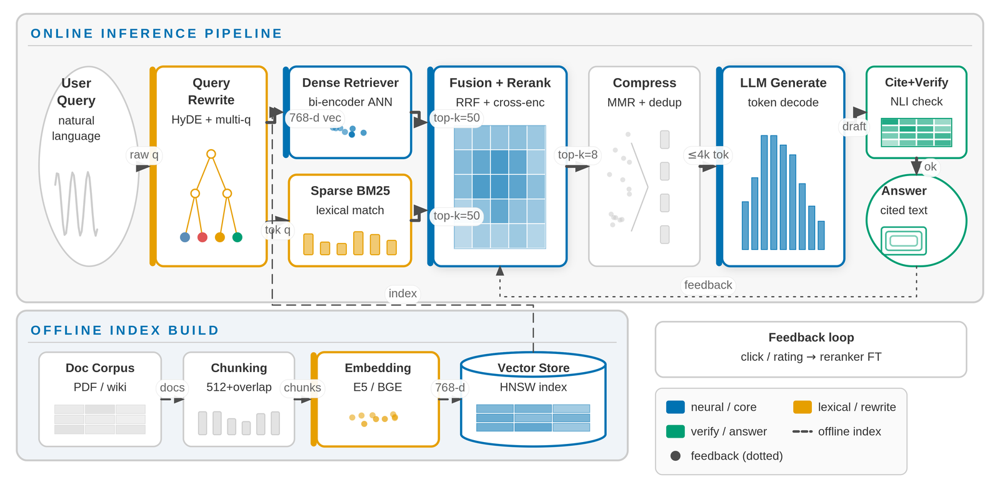
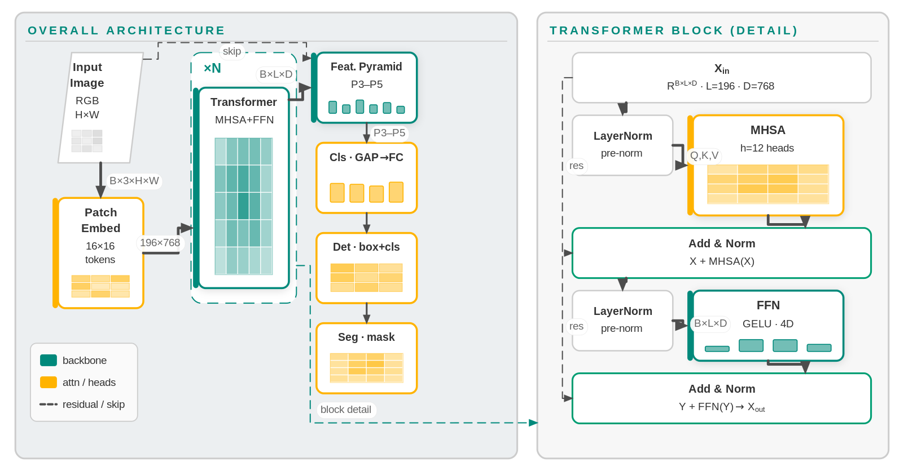
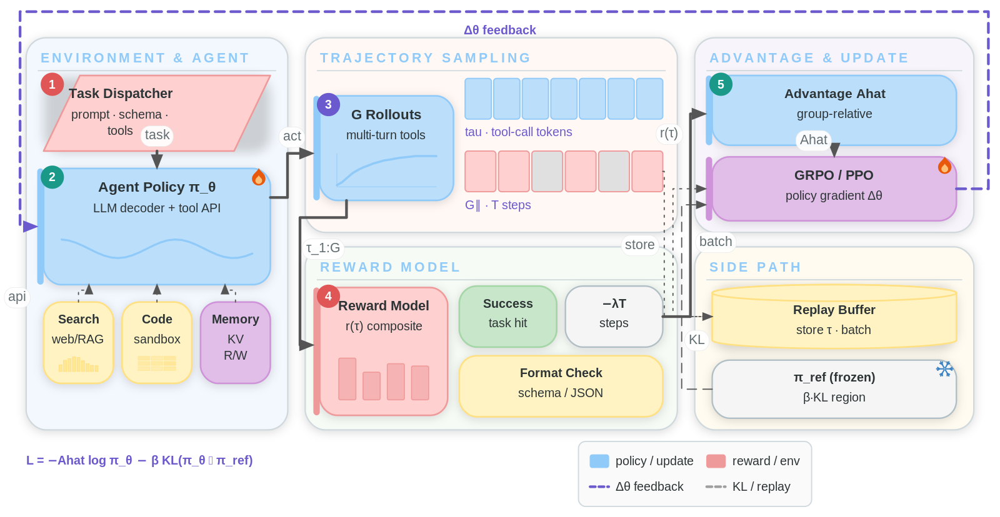
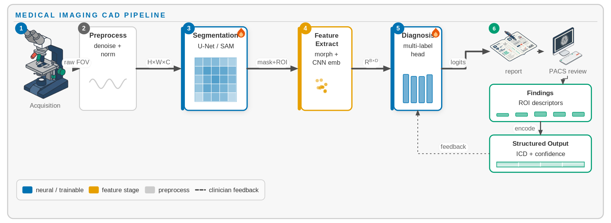

# Editable Academic Figure (paperfig)

**Editable, controllable, reproducible academic paper figures from a YAML spec.**  
**可编辑、可控、可复现的学术论文配图工具**——用 mm 坐标声明每个盒子/箭头/文字，代码渲染成 SVG+PNG；AI 只生成插画物件，文字/公式走矢量渲染，从根源规避乱码。

- **Controllable layout**：`layout:` 树（row/col/grid）或显式 mm 坐标；`resolve` 物化后可手改，100% 可复现。
- **AI 只画物件**：自动抠成透明 PNG；文字/连线/公式全部代码渲染。
- **顶会级信息密度**：`neurips` Soft Pastel / `topconf` / `editorial` / `isosystem`、`sketch`、inline `legend`、箭头语义。
- **生成即体检**：几何 + 视觉丰度 lint（含 `R-empty-box` / 箭头对齐）；本地 **studio** 拖拽微调。

|  | 纯代码作图 (draw.io/TikZ) | 纯 AI 生图 | **paperfig** |
| --- | --- | --- | --- |
| 布局精确可控 | ✅ | ❌ | ✅ |
| 可手工微调 / 复现 | ✅ | ❌ | ✅ |
| 文字清晰无乱码 | ✅ | ❌ | ✅（文字走代码） |
| 插画素材美观 | ❌ | ✅ | ✅（AI 画物件） |
| 视觉精美度（阴影/缩略图/图例/顶会风） | 靠手工堆叠 | 不可控 | ✅（主题 + sketch + legend） |
| 达到审稿人精度 | 勉强 | ❌ | ✅ |

> 📖 **人读教程** → [USAGE.md](USAGE.md)  
> 🤖 **AI 改图手册** → [AGENTS.md](AGENTS.md)（字段速查 + 配方）  
> 🧩 **Skill 入口** → [SKILL.md](SKILL.md)（Claude / Cursor / `npx skills`）  
> 🧭 **需求 → Figure Brief** → [prompts/FIGURE_BRIEF.md](prompts/FIGURE_BRIEF.md)（从零作图 Phase 0.5）  
> 📐 **作图算法** → [prompts/AGENT_WORKFLOW.md](prompts/AGENT_WORKFLOW.md)（四层分解 / 密度 checklist / 版式卡）

## 效果预览

下列四张图均由对应 YAML spec **完全复现**。spec 均为结构化布局——**内容元素零手写坐标**（盒子由 `layout:` 树求解摆位，箭头由 `route: avoid` 自动绕障）；需要精调时可用 `paperfig resolve` 物化成绝对坐标后再逐值修改。个别图含隐形辅助元素带手写坐标，属正常，并非全图零坐标。

**RAG 推理管线框架图**（`topconf`，上下双 section + 图例）：



→ [`examples/showcase/rag_framework.yaml`](examples/showcase/rag_framework.yaml)

**多任务视觉主干**（macro + micro 双面板，Teal + Amber 配色）：



→ [`examples/showcase/vision_backbone.yaml`](examples/showcase/vision_backbone.yaml)

**LLM Agent 强化学习闭环**（`airy` 柔彩主题，五分区 + 底部公式）：



→ [`examples/showcase/agent_rl.yaml`](examples/showcase/agent_rl.yaml)

**医学影像 CAD 管线**（内嵌 AI 生成素材；`assets_style` 风格包保证多素材风格统一）：



→ [`examples/showcase/medical_cad.yaml`](examples/showcase/medical_cad.yaml)

| 示例 | 领域 | 看点 |
| --- | --- | --- |
| `rep_evdispatch/` | 论文复现 | 彩色虚线分区 + scatter + 竖排文字 + AI 素材 |
| `rep_uavedge/` | 论文复现 | 弧线无线链路 + wifi/❌ + badge + 图例 |
| `rep_codriving/` | 论文复现 | 多列面板 + 叠影卡片 + 双色语义箭头 |
| `rep_d3pgmodel/` | 论文复现 | network 迷你 MLP + block 粗箭头 + ⊕ |
| `rep_ensemble/` | 论文复现 | 渐变色系列 + 空心箭头 + AI 线稿 |
| `paper_style/` | AI | panel + tokens + 🔥/❄ + 上下标 + 占位实验图 |
| `unet_lora/` | AI | trapezoid + 特征金字塔 tokens |
| `demo_method/` | AI | AI 素材（显微镜/报告）模块框架 |
| `transformer/` | AI | 纵向堆叠 + 残差 `via` |
| `rl_loop/` | AI | 环形训练闭环 |
| `cpu_pipeline/` | 体系结构 | 五级流水线（mono） |
| `memory_hierarchy/` | 体系结构 | 存储层次金字塔 |
| `gpu_arch/` | 体系结构 | 嵌套 group + cylinder |
| `mapreduce/` | 分布式 | fan-out/fan-in |
| `flowchart/` | 流程图 | stadium/parallelogram/diamond |
| `shapes/` | — | 8 种形状总览 |

## 安装

```bash
pip install -e .
# 或：pip install -r requirements.txt
sudo apt install libcairo2 fonts-noto-cjk fonts-liberation2   # 系统依赖
```

AI 素材（可选）：[grsai.ai](https://grsai.ai/zh) 拿 key → `export PAPERFIG_API_KEY=sk-xxxx`（兼容 `SCIFIG_API_KEY`）。默认生图模型为 `nano-banana-fast`（`python -m paperfig.cli assets --model` 可换）。无 key 时素材渲成虚线占位，不阻塞调布局。

## 快速开始

```bash
# 最小示例（见下方 YAML）
python -m paperfig.cli render hello.yaml -o hello.png

# 交互微调（拖拽 / 方向键 / 即时重渲）
python -m paperfig.cli studio hello.yaml
```

```yaml
# hello.yaml
figure: {width: 120, height: 40, dpi: 600}
theme: {preset: topconf}
elements:
  - {type: box, id: a, rect: [8, 10, 40, 22], title: Input, body: "raw x",
     variant: primary, accent: left, sketch: grid, valign: top}
  - {type: box, id: b, rect: [72, 10, 40, 22], title: Output, body: logits,
     variant: secondary, sketch: bars, valign: top}
  - {type: arrow, from: a, to: b, label: encode, weight: heavy}
```

### 五步工作流（从零作图）

1. **Figure Brief**（Phase 0.5）：用 [`prompts/FIGURE_BRIEF.md`](prompts/FIGURE_BRIEF.md) 把粗糙需求扩成结构化图纸说明（分区 / title·body·sketch / 箭头语义）。**已有精确改图指令则跳过。**
2. **写结构化 spec**：`layout:` 树摆盒子 + 箭头 `route: avoid`（零手写坐标）；新图默认 `theme: {preset: neurips}`。参见 [`examples/showcase/rag_framework_flex.yaml`](examples/showcase/rag_framework_flex.yaml)。
3. **占位渲染 / 物化**：`python -m paperfig.cli render fig.yaml --grid -o draft.png --dpi 180`；结构满意后 `python -m paperfig.cli resolve fig.yaml -o fig.resolved.yaml`，再对手调单个 `rect`。
4. **抽卡素材**（可选）：`python -m paperfig.cli assets fig.yaml` → 目检 contact sheet → `select` 换卡。
5. **定稿**：`python -m paperfig.cli render fig.yaml -o fig.png --svg fig.svg`（清零 E 级，尽量清零 `R-*`）。

## spec 速览

```yaml
figure: {width: 180, height: 80, dpi: 600}
theme:
  preset: neurips          # neurips | topconf | airy | editorial | isosystem
  # palette: {primary: "#00897B", secondary: "#FFB300"}   # 可选覆盖

elements:
  - {type: panel, id: p, rect: [4, 4, 172, 72], title: Overall Pipeline,
     header_style: smallcaps, fill: "#ECEFF1"}
  - {type: box, id: inp, rect: [12, 20, 36, 36], title: Input, body: "raw x",
     variant: primary, accent: left, sketch: grid, valign: top}
  - {type: box, id: core, rect: [66, 20, 44, 36], title: Core Module,
     variant: primary, sketch: layers, valign: top, shadow: true}
  - {type: box, id: out, rect: [128, 20, 36, 36], title: Output, body: "y",
     variant: secondary, sketch: bars, valign: top}
  - {type: arrow, from: inp, to: core, label: "R^{B×D}", weight: heavy}
  - {type: arrow, from: core, to: out, label: logits, weight: heavy}
  - {type: arrow, from: out.top, to: core.top, route: arc, style: dashed,
     label: feedback, weight: thin}
  - {type: legend, id: lg, at: [118, 60], columns: 3, items: [
      {swatch: box, color: "#00897B", label: "core"},
      {swatch: box, color: "#FFB300", label: "aux"},
      {swatch: dashed, color: "#4D4D4D", label: "skip"},
    ]}
```

**元素类型**：`box` · `panel` · `sketch`（14 种程序化缩略图）· `legend` · `asset` · `arrow` · `group` · `tokens` · `marker` · `network` · `scatter` · `badge` · `text` · `panel_label`。

**box 形状**：`rect` / `stadium` / `diamond` / `cylinder` / `parallelogram` / `hexagon` / `ellipse` / `trapezoid`。支持 `accent` / `header_fill` / `shadow` / `sketch` / `stack` / `gradient`。

**箭头**：裸 id `from: a, to: b` 自动选朝向对方的边；`route`: `auto|straight|hv|vh|z|zv|arc|avoid`（**推荐 `avoid`**：正交避障，失败回退 `auto`）；`weight`: `thin|normal|heavy`；`style` 含 `dotted`；`via` 仅作微调；`label_pos: auto` 碰撞打分落标（`avoid` 默认开启）；末段强制垂直进入目标边。

**结构化布局**：顶层 `layout:` 支持嵌套 `row`/`col`/`grid`，`gap`/`pad`/`justify`/`align`/`flex`；叶子 `{ref: id, w, h}` 省略 `rect`；容器可 `type: panel`。`resolve` 写出纯绝对坐标 YAML。

坐标 **mm**，字号 **pt**。调布局加 `--grid`。

## 命令

| 命令 | 作用 |
| --- | --- |
| `render spec [-o png] [--svg svg] [--grid] [--dpi N] [--strict]` | 渲染 + 体检 |
| `resolve spec [-o out.yaml] [--force]` | layout 树 → 绝对坐标 YAML |
| `studio spec [--port 8323]` | 交互式调图 |
| `assets spec [--api-key KEY] [--only ids] [--force]` | 抽卡生成素材 |
| `select spec ASSET_ID INDEX` | 换卡（零 API 成本） |
| `cutout in.png out.png` | 单独抠白底图 |

**Keywords / 关键词**: academic figure · paper figure · editable · controllable layout · reproducible · architecture diagram · framework diagram · YAML spec · SVG · 论文配图 · 学术作图 · 论文架构图 · 顶会风格图 · CVPR/NeurIPS style
