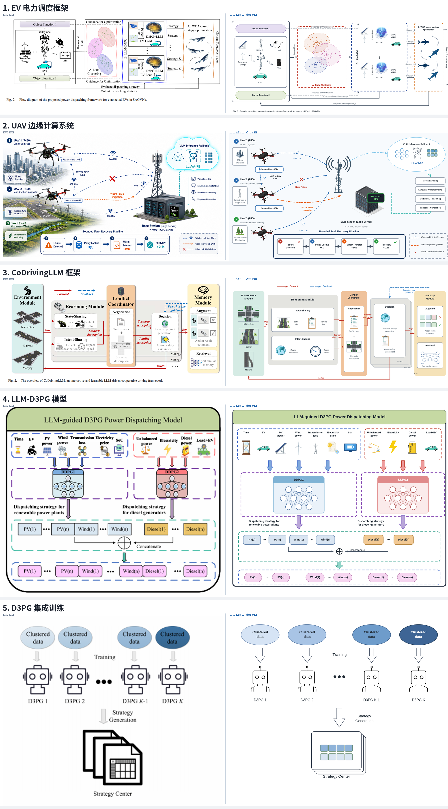

# scifig — 受控科研图片生成工具

把「代码定布局的精确可控」和「AI 生成素材的美观」结合起来，产出**审稿人能接受**的科研图。

- **布局由代码定，逐像素可控**：一份 YAML `spec` 显式声明每个盒子、箭头、文字的 mm 坐标。改任何一个数值重渲即可精确微调，结果 100% 可复现——不会像纯 AI 生图那样"抽一次变一个样"。
- **素材由 AI 生成，可换可退**：需要显微镜、芯片、报告文档这类插画时，调用生图模型生成**白底图**，自动**抠成透明 PNG** 嵌进版面。文字、连线、公式全部走代码渲染，AI 只画"物件"，从根源规避 AI 乱码文字这个最大雷点。
- **生成即体检**：每次渲染自动跑几何 lint（溢出/重叠/越界/穿线/字号/疏密），像短视频工作流里的视觉评审闭环一样，先过机检再目检。

|  | 纯代码作图 (draw.io/TikZ) | 纯 AI 生图 | **scifig** |
| --- | --- | --- | --- |
| 布局精确可控 | ✅ | ❌ | ✅ |
| 可手工微调/复现 | ✅ | ❌ | ✅ |
| 文字清晰无乱码 | ✅ | ❌ | ✅（文字走代码） |
| 插画素材美观 | ❌ | ✅ | ✅（AI 画物件） |
| 达到审稿人精度 | 勉强 | ❌ | ✅ |

> 📖 **完整使用说明 + 实践经验建议见 [USAGE.md](USAGE.md)**（人读）。
> 🤖 **让 AI 助手后期二次修改这张图？见 [AGENTS.md](AGENTS.md)**（AI 读，含字段速查 + 改图配方）。
> 🧩 **作为主流 coding agent 的 skill 使用？见 [SKILL.md](SKILL.md)**（Claude / Cursor / `npx skills` 生态自动发现入口，YAML frontmatter + 触发描述，主体仍指向 AGENTS.md）。

## 效果预览

覆盖 AI / 体系结构 / 分布式 / 流程图各类图型，`examples/` 下均可直接渲染：

| 示例 | 领域 | 看点 |
| --- | --- | --- |
| `rep_evdispatch/` | **论文复现** | 彩色虚线分区 + scatter 聚类 + 竖排文字 + AI 素材（大脑/鲸鱼/光伏） |
| `rep_uavedge/` | **论文复现** | 弧线无线链路 + wifi/❌ 标记 + badge 步骤条 + 图例框 |
| `rep_codriving/` | **论文复现** | 多列彩色面板 + 白色子卡 + 双色语义箭头 + 叠影卡片 |
| `rep_d3pgmodel/` | **论文复现** | network 迷你 MLP + block 粗箭头 + ⊕ 拼接 + 图标阵列 |
| `rep_ensemble/` | **论文复现** | 渐变色系列 + 空心箭头 + 叠影文档 + AI 线稿机器人 |
| `paper_style/` | AI | panel 分区 + tokens 序列 + 🔥/❄ marker + 上下标 + 渐变 + 占位实验图 |
| `unet_lora/` | AI | 扩散 U-Net + LoRA：trapezoid 采样块 + 特征金字塔 tokens |
| `demo_method/` | AI | 含 AI 素材（显微镜/报告），模块框架图 |
| `transformer/` | AI | 纵向堆叠 + 残差 `via` 绕线 |
| `rl_loop/` | AI | 环形训练闭环 |
| `cpu_pipeline/` | 体系结构 | 五级流水线（mono 主题） |
| `memory_hierarchy/` | 体系结构 | 存储层次金字塔 |
| `gpu_arch/` | 体系结构 | 嵌套 group + 显存 cylinder |
| `mapreduce/` | 分布式 | fan-out/fan-in 数据流 |
| `flowchart/` | 流程图 | stadium/parallelogram/diamond 规范 |
| `shapes/` | — | 8 种形状总览 |

**对真实论文图的复现能力**（左原图 / 右 scifig 复现，见 `comparison.png`）：



## 安装

```bash
pip install -r requirements.txt
```

系统依赖：`libcairo2`（cairosvg 需要）与中文字体 `fonts-noto-cjk`。多数 Linux 桌面已自带；缺失时：

```bash
sudo apt install libcairo2 fonts-noto-cjk fonts-liberation2
```

## 交互式微调：studio（推荐）

改一个数就得重跑 CLI 太笨重——`studio` 起一个本地网页（零额外依赖，Python 标准库 + 单文件原生 JS）：

```bash
python -m scifig.cli studio examples/rep_evdispatch/figure.yaml
# 浏览器自动打开 http://127.0.0.1:8323/
```

- **改动即时重渲**：左侧编辑 YAML，右侧预览自动刷新，体检结果实时列出（点击条目定位到出错元素）。
- **点选与拖拽**：点预览里的元素 → 高亮并定位到对应 YAML 行；直接**拖拽元素**改位置（自动写回 `rect`/`at`，0.5mm 吸附、按 Alt 0.1mm）。
- **细微参数微调**：选中后**方向键**微调（0.1/0.5/2mm 三档）；编辑器里光标放在任意数字上 **Alt+↑↓** 步进；所有改动都是普通文本编辑，Ctrl+Z 可撤销。
- **保存/导出**：Ctrl+S 保存 YAML；「导出」一键出 PNG + SVG（可选 DPI）。

## 四步工作流

```bash
# 1. 写 spec（见 examples/），先占位渲染调布局——素材还没生成时用虚线占位框
python -m scifig.cli render examples/demo_method/figure.yaml --grid -o draft.png

# 2. 抽卡生成 spec 里声明的 AI 素材（每个默认抽 3 张候选，自动抠图+评分+选卡）
python -m scifig.cli assets examples/demo_method/figure.yaml --api-key sk-xxxx

# 3.（可选）不满意就看 contact sheet 换卡，或整体重抽
python -m scifig.cli select examples/demo_method/figure.yaml report_doc 2   # 手动选 2 号候选
python -m scifig.cli assets examples/demo_method/figure.yaml --only report_doc --force  # 重抽

# 4. 正式渲染 + 体检（默认 600dpi）
python -m scifig.cli render examples/demo_method/figure.yaml -o figure.png --svg figure.svg
```

## spec 速览

```yaml
figure:
  width: 180          # mm，双栏图宽
  height: 96
  dpi: 600
  assets_dir: assets  # AI 素材目录（相对 spec）

theme:
  preset: sci         # sci | warm | mono，也可写 theme: sci

assets:               # 声明要 AI 生成的素材（抽卡对象）
  - {id: microscope, prompt: 一台简洁的光学显微镜, 蓝灰色扁平插画, candidates: 3}

elements:
  - {type: box,   id: enc, rect: [62, 22, 34, 22], title: 编码器, body: 对齐表示, variant: secondary, icon: microscope}
  - {type: box,   id: db,  rect: [110, 22, 24, 22], title: 存储, shape: cylinder}
  - {type: asset, id: out, rect: [160, 30, 16, 36], src: report_doc, caption: 报告}
  - {type: arrow, from: enc, to: out, label: 输出}   # 裸 id 自动选朝向对方的边，不会"没对上"
  - {type: arrow, from: enc.left, to: db.top, via: [[50, 10]], style: dashed}
  - {type: group, members: [enc], label: 主干, style: dashed}
  - {type: text,  at: [90, 4], text: 图 1. 方法总览, size: 8, bold: true}
  - {type: panel_label, at: [6, 6], text: a}
```

**元素类型**：`box`（带标题/正文/图标的盒子，可作容器卡、可叠影）、`asset`（独立素材图+图注，`placeholder: true` 为真实实验图占位槽）、`arrow`（连线：折线/弧线/粗 block 箭头）、`panel`（带色条标题的分区面板）、`tokens`（token/特征图条组）、`marker`（🔥/❄/⊕/⊗/wifi 等矢量角标）、`network`（迷你 MLP）、`scatter`（聚类散点）、`badge`（编号圆点）、`group`（分组框，可自定义颜色作彩色分区）、`text`（自由文字，支持换行/斜体/旋转竖排）、`panel_label`（a/b/c 面板号）。

**box 形状**（`shape`）：`rect`(默认)/`stadium`(起止)/`diamond`(判定)/`cylinder`(数据库)/`parallelogram`(输入输出)/`hexagon`(预处理)/`ellipse`/`trapezoid`(采样块)。支持 `gradient` 渐变、`fill/stroke/text_color` 逐盒配色、`stack` 叠影。

**数学记号**：标题/正文/text 支持 `_{...}` 下标、`^{...}` 上标，如 `E_{s}`、`ℝ^{(B V) H W C}`、`L_{InfoNCE}`。

**锚点**：最简写**裸节点 id**（`from: a, to: b`）——渲染自动选朝向对方的边、落在边中点，消除"箭头没对上"；要精确控制才写 `节点id.side`，side ∈ `left/right/top/bottom/center`，可加 `@t`（0~1）指定边上位置，如 `enc.right@0.3`。

**箭头路由**：`auto`（按锚点边智能选）/`straight`/`hv`/`vh`/`z`（横向 Z）/`zv`（纵向 Z）；或用 `via: [[x,y],...]` 手动途经点（残差/skip/绕线）。

坐标单位一律 mm，字号 pt。调布局时加 `--grid` 叠加 10mm 网格。

## 命令

| 命令 | 作用 |
| --- | --- |
| `render spec [-o png] [--svg svg] [--grid] [--dpi N] [--strict]` | 渲染 + 体检 |
| `studio spec [--port 8323] [--no-open]` | 交互式调图界面（即时重渲、拖拽/键盘微调） |
| `assets spec --api-key KEY [--only ids] [--force] [--no-auto-select]` | 抽卡生成素材 |
| `select spec ASSET_ID INDEX` | 把候选 #INDEX 提升为正式素材 |
| `cutout in.png out.png [--threshold 238] [--shadow keep\|remove]` | 单独抠一张白底图 |

## 关于"抽卡"（重要）

当前生图技术产出天然不稳定，一次生成不一定达标是**正常现象**。scifig 的对策：

1. **一次多抽**：每个素材默认并发抽 3 张（`candidates` 可调），生成 `contact_sheet_{id}.png` 供对比。
2. **客观评分先过滤**：抠图后按前景占比、连通块数、是否贴边裁断打分（见 `gacha_report.json`），自动选最高分；`reject` 卡直接淘汰。
3. **换卡零成本**：候选都留在 `assets/candidates/`，`select` 换卡不重新花钱；仍不满意再 `--force` 重抽或改 prompt。
4. **审美判断交给看图**：分数只管客观项（干不干净），色调是否协调、造型是否贴切要靠目检——这正是把 `select` 独立出来的原因。

## 目录结构

```
scifig/
  scifig/            核心库：spec / render / cutout / assets / lint / fonts / theme / cli
                     + studio.py & studio.html（交互式调图界面，零额外依赖）
  examples/          16 个可直接渲染的示例（rep_* 为真实论文图复现）
  prompts/           visual_rubric.md（评审标准）、AGENT_WORKFLOW.md（从零作图分阶段流程）
  SKILL.md           主流 coding agent skill 入口（Claude/Cursor/npx skills 发现用）
  AGENTS.md          给 AI 助手的字段速查 + 二次改图配方（Cursor/Claude 自动加载）
  USAGE.md           面向人的完整使用说明
  tests/             回归测试（53 项）
  requirements.txt
```
